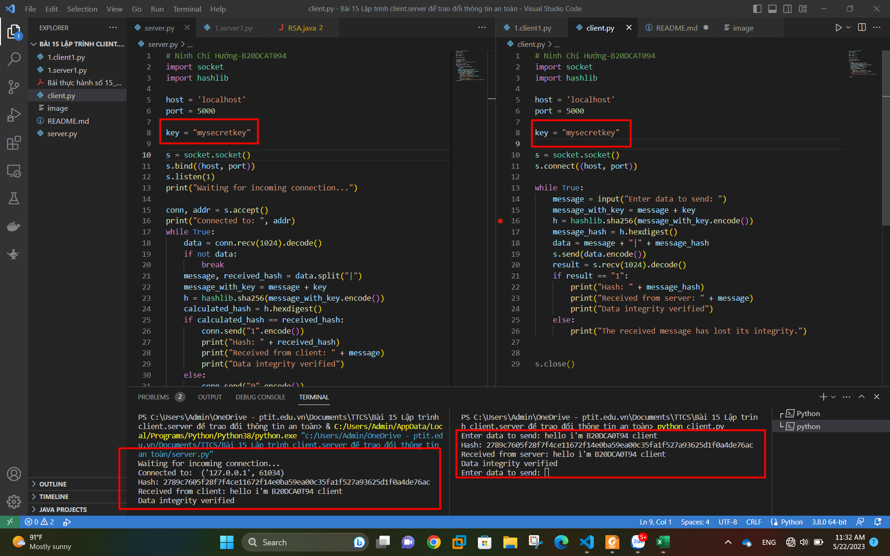
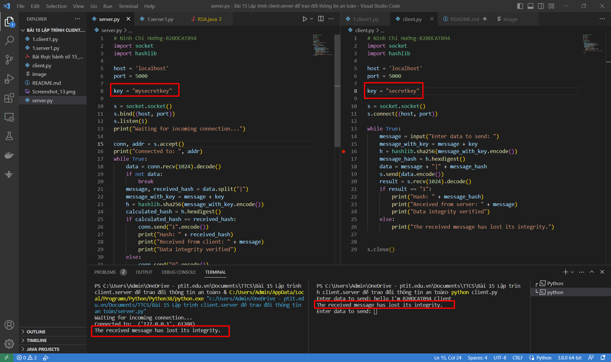

## Chỉnh sửa lại nội dung phần xác thực truyền thông tin ở phần 2 Bài 15

phía Client sẽ gửi thông điệp "Hello I'm B20DCAT094 Client" dạng plain text + giá trị băm của(thông điệp +key).Key được Client và Server thống nhất từ trước. Phía Server sẽ nhận và đối chiếu, nếu đảm bảo tính toàn vẹn thì sẽ in ra "Data integrity verified" và đồng thời gửi "1" cho Client để báo rằng tính toàn vẹn được xác thực

 
Bây giờ ta sẽ thay đổi Key ở phía Client và sau đó gửi lại thông điệp "Hello I'm B20DCAT094 Client" + giá trị băm. Server nhận được và đối chiếu giá trị băm thấy thay đổi và in ra "The received message has lost its integrity." và gửi "0" lại cho Client để báo rằng thông điệp bị mất đi tính toàn vẹn.

